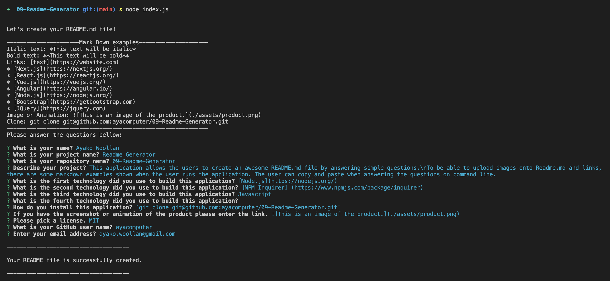

---
  
# Readme Generator

  

Table of Contents

  
<ol>
  
<li>
  
<a href="#about-the-project">About The Project</>
  
<ul>
  
<li><a href="#built-with">Built With</a></>
  
</ul>
  
</li>
<li>

<a href="#getting-started"> Getting Started</>

<ul>

<li><a href="#installation">Installation</a></>

</ul>

</li> 
<li><a href="#usage">Usage</a></>
<li><a href="#license">License</a></>
  
<li><a href="#contact">Contact</a></>
  
</ol>
  

 ## About The Project

 [![ProductScreen Shot][product - screenshot]](./assets/screenshot/product.png)

This application allows the users to create a nice looking README.md file by answering simple questions. 

 (<a href="#top">back to top</a>)</>

 ## Built With
* [Node.js](https://nodejs.org/) 
* [npm inquirer](https://www.npmjs.com/package/inquirer) 

 (<a href="#top">back to top</a>)</>

## Getting Started

To get a local copy up and running follow these simple example steps.

 ## Installation

 Clone this repo to your local repo \n`git clone git@github.com:ayacomputer/09-Readme-Generator.git`

(<a href="#top">back to top</a>)</>

## Usage

 Following animation and images show this application's functionality.

 

(<a href="#top">back to top</a>)</>

## License

Distributed under MIT License.

See LICENSE.txt for more information.

(<a href="#top">back to top</a>)</>

 ## Contact Me

Ayako Woollan - ayako.woollan@gmail.com

Project Link: [https://github.com/ayacomputer/09-Readme-Generator](https://github.com/ayacomputer/09-Readme-Generator)

(<a href="#top">back to top</a>)</>
